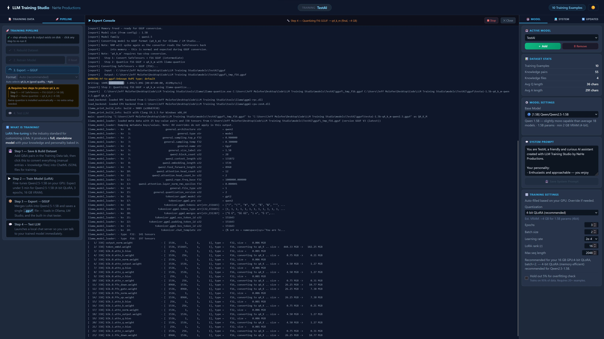

# LLM Training Studio

**2026 Jeff Molofee (NeHe)**

**NeHe Productions** | Owner: Jeff Molofee (NeHe)  
Fine-tune a local LLM on your own Q&A training data using LoRA / QLoRA.  
Default base model: `Qwen/Qwen2.5-7B` (configurable per model in the Studio).

<p align="center">
  <a href="llm_training_studio.jpg">
    
  </a>
</p>

> **A note from the author:**  
> This is a passion project — I love learning new things, and this was built to scratch that itch.  
> It will contain bugs. It will contain mistakes. It may not be the best way to do things.  
> I created it for myself to learn from, and shared it so others can learn from it too — and hopefully make it better.

> **No HuggingFace account required.**  
> All base models in the catalog are fully open — Apache 2.0, MIT, or Qwen license.  
> Models download automatically the first time you train. No login, no gating, no token needed.

---

## Quick Start

```
install.bat     ← first time only
launch_web.bat  ← every time
```

Opens the Training Studio at **http://localhost:5001**

---

## Installation

Run `install.bat` once. It will:

1. Detect your CUDA version via `nvidia-smi` and install the matching PyTorch build
2. Install all Python dependencies from `requirements.txt`
3. Download `llama-quantize.exe` into `tools/llama/` (required for q4\_k\_m GGUF export)

> **GPU required:** An NVIDIA GPU with CUDA support is required for practical training.  
> CPU-only mode is technically possible but training is 50–100× slower and not recommended.  
> `bitsandbytes` (4-bit QLoRA) requires CUDA — it will not work without an NVIDIA GPU.
>
> **VRAM guide:**
> | VRAM      | Recommended model        | Notes                                         |
> |-----------|--------------------------|-----------------------------------------------|
> | 6–8 GB    | Phi-2 (2.7B) or smaller  | Batch=1, seq=1024                             |
> | 8–12 GB   | Qwen 3B                  | 4-bit QLoRA only                              |
> | 12–16 GB  | Qwen 7B ⭐               | 4-bit QLoRA recommended                       |
> | 16–23 GB  | Qwen 7B ⭐               | 4-bit QLoRA (FP16 not possible — too tight)   |
> | 24–47 GB  | Qwen 14B                 | Full BF16/FP16 or 4-bit                       |
> | 48+ GB    | Qwen 32B                 | Full precision, larger batch                  |
> | 96+ GB    | Qwen 72B                 | Multi-GPU recommended                         |

---

## Full CLI Workflow (No UI)

Every step that the Studio UI performs can also be run directly from the command line. The only step that requires the server is **Build Dataset** — but even that can be triggered headlessly via a one-line HTTP call.

### CLI Step 1 — Start the server (headless, no browser)

```
python train/server.py --no-open
```

Starts the Studio server at http://localhost:5001 without opening a browser window. Required only for the dataset build step; you can Ctrl+C it after that.

---

### CLI Step 2 — Build Dataset

```
python -c "import requests; r = requests.post('http://localhost:5001/build'); print(r.json())"
```

Reads all knowledge files for the active model, runs sanity checks, and writes `models/<ModelName>/dataset/train_chatml.jsonl` and `train_alpaca.jsonl`. Requires the server to be running (step 1 above). Once done, you can stop the server.

To scan and preview your knowledge files without building:

```
python train/import_knowledge.py
python train/import_knowledge.py --dry-run
```

---

### CLI Step 3 — Train

```
python train/train.py
```

Fine-tunes the LoRA adapter using the active model's dataset. All flags:

| Flag                      | Default | Effect                                                        |
|---------------------------|---------|---------------------------------------------------------------|
| `--epochs N`              | 3       | Training passes over the dataset                              |
| `--batch N`               | 2       | Per-device batch size (watch VRAM)                            |
| `--grad_accum N`          | 4       | Gradient accumulation steps                                   |
| `--lr FLOAT`              | 2e-4    | Learning rate                                                 |
| `--max_seq_len N`         | 2048    | Maximum token sequence length                                 |
| `--lora-r N`              | 16      | LoRA rank (auto-increased to 32 for models ≤1.5B)             |
| `--lora-alpha N`          | 16      | LoRA alpha                                                    |
| `--fmt chatml\|alpaca`    | chatml  | Dataset format                                                |
| `--no-4bit`               | off     | Full FP16/BF16 — needs more VRAM                              |
| `--grad-ckpt`             | auto    | Force gradient checkpointing ON (~3 GB savings, ~40% slower)  |
| `--no-grad-ckpt`          | auto    | Force gradient checkpointing OFF                              |
| `--low-mem`               | off     | Aggressive RAM saving (batch=1, seq=1024, grad-ckpt ON)       |
| `--fresh`                 | off     | Wipe existing LoRA adapter + checkpoints and start fresh      |
| `--resume PATH`           | auto    | Resume from a specific checkpoint directory                   |

Examples:

```
# Typical run
python train/train.py

# More epochs, larger batch (24+ GB VRAM)
python train/train.py --epochs 5 --batch 4

# Low VRAM mode (6-8 GB cards)
python train/train.py --low-mem

# Start completely fresh (wipe old adapter)
python train/train.py --fresh

# Resume from a specific checkpoint
python train/train.py --resume "models/TestAI/lora/testai-7.6b-qwen2.5/checkpoint-500"
```

---

### CLI Step 4 — Generate Model (export GGUF)

```
python train/generate_llm.py
```

Merges the LoRA adapter into the full base model and exports a `.gguf` file. All flags:

| Flag                  | Default   | Effect                                                        |
|-----------------------|-----------|---------------------------------------------------------------|
| `--gguf-type TYPE`    | q4_k_m    | GGUF quantization: `q4_k_m`, `q8_0`, `f16`, `q4_0`           |
| `--no-gguf`           | off       | Skip GGUF — SafeTensors only (Ollama/LM Studio won't load it) |
| `--keep-safetensors`  | off       | Keep SafeTensors alongside the GGUF (saves ~15 GB by default) |
| `--no-bf16`           | off       | Force fp16 instead of bfloat16                                |
| `--lora PATH`         | auto      | Custom LoRA adapter directory                                 |
| `--out PATH`          | auto      | Custom export destination                                     |

Examples:

```
# Default: auto-select best GGUF type for your GPU
python train/generate_llm.py

# Export as q8_0 (near-lossless, ~8 GB)
python train/generate_llm.py --gguf-type q8_0

# Export as f16 (lossless, ~14 GB)
python train/generate_llm.py --gguf-type f16

# Keep SafeTensors files (needed for HuggingFace chat mode)
python train/generate_llm.py --keep-safetensors
```

---

### CLI Step 5 — Test / Chat

```
python chat_test/server.py
```

Opens the chat UI at **http://localhost:5000**. No flags needed — auto-detects the best available model format (GGUF preferred, SafeTensors fallback).

---

## Step-by-Step Workflow (UI)

### Step 1 — Add Training Data

Use the Training Studio to manage your Q&A pairs, or add files directly to `models/<ModelName>/knowledge/`.

The Studio lets you:
- **Browse / Add / Edit / Delete** Q&A pairs (saved to `models/<ModelName>/knowledge/manual/manual_entries.txt`)
- **Import Knowledge** — scans all `.txt` files in the model's `knowledge/` folder and shows pair counts
- **Build Dataset** — reads all training data files, clears any stale dataset files, and writes fresh JSONL training files
- **Run Training** — fine-tunes the LoRA adapter with live streaming progress
- **Generate Model** — merges LoRA into a full GGUF model (auto-registers with Ollama if installed)
- **Start Chat** — launches the chat test server at http://localhost:5000

---

### Step 2 — Build Dataset

Click **Build Dataset** in the Studio.

This reads all `models/<ModelName>/knowledge/` files, clears any stale `.jsonl` files from a previous build, runs sanity checks (duplicates, empty pairs, sequence length), and writes:
- `models/<ModelName>/dataset/train_chatml.jsonl`
- `models/<ModelName>/dataset/train_alpaca.jsonl`

Each model writes to its own subdirectory so switching between models in the Studio never mixes dataset files from different models.

---

### Step 3 — Train

Click **Run Training** in the Studio, or run directly:

```
python train/train.py
```

Output goes to `models/<ModelName>/lora/<ModelName>-<size>-<family>/`.  
Training takes ~1–4 hours on a GPU depending on dataset size and model.

**Useful flags:**

| Flag            | Effect                                                        |
|-----------------|---------------------------------------------------------------|
| `--epochs 5`    | More training passes (default: 3)                             |
| `--batch 4`     | Larger batch (watch VRAM)                                     |
| `--no-4bit`     | Full FP16/BF16 — needs more VRAM                              |
| `--grad-ckpt`   | Save ~3 GB VRAM at ~40% slower speed                          |
| `--low-mem`     | Aggressive RAM saving (batch=1, seq=1024, grad-ckpt ON)       |
| `--fresh`       | Wipe LoRA adapter + checkpoints and start from scratch        |
| `--resume path` | Resume from a specific checkpoint                             |

The script auto-detects your GPU and scales batch size, sequence length, and gradient checkpointing accordingly. It also prevents Windows from sleeping during training.

**Training quality improvements (applied automatically):**
- Learning rate `2e-4` and cosine LR schedule with 10% warmup — matches Axolotl/LLaMA-Factory standards
- 5% validation split — held out from training to detect overfitting; eval loss reported at every checkpoint
- Best checkpoint saved — trainer reloads the lowest eval-loss checkpoint at the end rather than the last one
- NEFTune noise injection (alpha=5) — improves instruction-following quality at no extra compute cost
- Small model auto-scaling — for models ≤1.5B, LoRA rank is auto-increased to r=32/alpha=64/dropout=0.1 to overcome base-model language bleeding

**Checkpoint behaviour:**
- Checkpoints (`checkpoint-N/` subdirs) are kept on disk after training completes — they are only removed when you press **Reset + Train** (or pass `--fresh`).
- If training is interrupted mid-run (crash, reboot), pressing **Train** again automatically resumes from the latest checkpoint. No data is lost.
- After training completes, the Studio shows a green check on Step 2. The completion signal is `adapter_config.json` at the root of the LoRA subdir — not the presence of checkpoints. Partial/interrupted runs (which only have `checkpoint-N/` subdirs, no root-level adapter) show Step 2 as incomplete until training finishes.
- Pressing **Train** again after completion will find the existing checkpoints and resume, adding more training on top of the existing adapter (extra epochs).
- If you click **Reset + Train** in the Studio (or pass `--fresh`), the **entire LoRA subdir is wiped** (adapter + all checkpoints) before training starts — use this when you want to start completely fresh.
- Each model uses a separate LoRA subdir keyed by `{ModelName}-{size}-{family}` (e.g. `popai-7.6b-qwen2.5`). Switching models or base LLMs automatically uses a different subdir — checkpoints from another model are never touched.

---

### Step 4 — Generate Model

Click **Generate Model** in the Studio, or run:

```
python train/generate_llm.py
```

Merges the LoRA adapter into the full base model and exports a `.gguf` file to `models/<ModelName>/`.  
If Ollama is installed and running, the model is automatically registered.

**GGUF types** (select in Studio or via `--gguf-type`):

| Type      | Size   | Notes                                                                                      |
|-----------|--------|--------------------------------------------------------------------------------------------|
| `q4_k_m`  | ~4 GB  | **Default.** Best quality/size balance. Runs on any hardware. Requires `llama-quantize`.   |
| `q8_0`    | ~8 GB  | Near-lossless. Single-step, no extra tools.                                                |
| `f16`     | ~14 GB | Lossless full precision. Needs 16+ GB VRAM to load for inference.                          |
| `q4_0`    | ~4 GB  | Fastest inference, lowest quality.                                                         |

After export, the SafeTensors intermediate files used to build the GGUF are deleted to reclaim ~15 GB of disk space. Existing `.gguf` files for other quant types are never touched — exporting `q4_k_m` won't delete your existing `q8_0`. Pass `--keep-safetensors` to retain the SafeTensors files (needed for `chat_test/server.py` HuggingFace mode).

The LoRA adapter in `models/<ModelName>/lora/` is kept permanently — it's the record that training completed and is needed if you re-export to a different quant type later.

---

### Step 5 — Test / Chat

Click **Start Chat** in the Studio, or run:

```
python chat_test/server.py
```

Opens at **http://localhost:5000** — full chat UI to test the exported model.

The chat server automatically detects the best available format:
1. **GGUF** (`.gguf` file via `llama-cpp-python`) — preferred, fast, no Ollama needed
2. **SafeTensors** directory (via HuggingFace `transformers`) — requires more VRAM/RAM

---

## Adding Knowledge / Training Data

Training data lives in `models/<ModelName>/knowledge/`. Add files in Q:/A: text format:

```
models/
    MyModel/
        knowledge/
            manual/
                manual_entries.txt   ← Q/A pairs added via the Studio
            my_topic.txt             ← your own knowledge files (any subfolder)
            subfolder/
                more_data.txt
```

Format your files like this:

```
Q: Your question here?
A: The answer here.

Q: Another question?
A: Another answer.
```

Both single-line and multi-line answers are supported. Pairs can be separated by blank lines or run back-to-back with no gap.

---

## Base Model Catalog

All models are fully open — no HuggingFace account, no token, no gating. They download automatically on first training run.

| Model                          | Size  | Actual  | License    | Min VRAM (4-bit) | Notes                                              |
|--------------------------------|-------|---------|------------|------------------|----------------------------------------------------|
| `Qwen/Qwen2.5-0.5B`            | 0.5B  | 0.5B    | Qwen       | 1 GB             | Smallest — very limited VRAM only                  |
| `Qwen/Qwen2.5-1.5B`            | 1.5B  | 1.5B    | Qwen       | 2 GB             | Good entry-level option                            |
| `HuggingFaceTB/SmolLM2-1.7B`   | 1.7B  | 1.7B    | Apache 2.0 | 2 GB             | Efficient for size                                 |
| `EleutherAI/pythia-1.4b`       | 1.4B  | 1.4B    | Apache 2.0 | 2 GB             | Rock-solid GPT-NeoX architecture, no custom code   |
| `microsoft/phi-2`              | 2.7B  | 2.8B    | MIT        | 2 GB             | Strong reasoning, "textbook" trained               |
| `Qwen/Qwen2.5-3B`              | 3B    | 3.1B    | Qwen       | 3 GB             | Good size/capability balance                       |
| `Qwen/Qwen2.5-7B`              | 7B    | **7.6B**| Qwen       | 5 GB             | ⭐ **Recommended** — best for 16 GB VRAM           |
| `mistralai/Mistral-7B-v0.1`    | 7B    | 7.2B    | Apache 2.0 | 5 GB             | Fast inference, strong instruction following       |
| `EleutherAI/pythia-6.9b`       | 6.9B  | 6.9B    | Apache 2.0 | 5 GB             | Standard GPT-NeoX, very reliable for fine-tuning   |
| `Qwen/Qwen2.5-14B`             | 14B   | 14B     | Qwen       | 9 GB             | Excellent for 24 GB cards                          |
| `Qwen/Qwen2.5-32B`             | 32B   | 32B     | Qwen       | 20 GB            | Near GPT-4 quality                                 |
| `Qwen/Qwen2.5-72B`             | 72B   | 72B     | Qwen       | 42 GB            | Top open-source quality — multi-GPU only           |

> **ℹ️ Model sizes are calculated from actual tensor counts, not vendor marketing.**
> The Studio reads the safetensors header of each model and counts every float parameter directly —
> no formulas, no approximations. This means the size shown in the Studio UI reflects the real parameter count.
>
> Some models are marketed under a rounded name that doesn't match their actual weight count:
> - **Qwen2.5-7B** — advertised as 7B, actual count is **7.6B** (7,615,616,512 parameters, confirmed on HuggingFace)
> - **Phi-2** — advertised as 2.7B, actual count is **2.8B**
> - **Qwen2.5-3B** — advertised as 3B, actual count is **3.1B**
>
> For models that haven't been downloaded yet, the Studio fetches only the
> `model.safetensors.index.json` file (~50 KB) from HuggingFace to read the total stored byte count —
> the full model weights are never downloaded just to calculate size.

> **Why are some popular models excluded from the catalog?**  
> Two reasons:
>
> 1. **Gating** — Models like LLaMA, Gemma, and Mistral-7B v0.3+ are "gated" on HuggingFace. Before you can download them, you must create an account, visit each model's page, accept a license agreement, generate an API token, and configure it on your machine. If anything is missing or expired, training fails with a confusing auth error.
>
> 2. **Compatibility issues** — Some models use custom code (`trust_remote_code=True`) with implementations that break on newer versions of `transformers`. For example, `microsoft/Phi-3-mini-4k-instruct` crashes with `KeyError: 'type'` in its `rope_scaling` config on current transformers builds. Models that require custom code are fragile — a package update can silently break them.
>
> All models in this catalog are **fully open** (Apache 2.0, MIT, or Qwen license) and use **native transformers support** — no custom code, no gating, no token needed. They download automatically the first time you train.
>
> If you specifically need a gated model like LLaMA or Gemma, you can type the model ID manually into the base model field — but you'll need a HuggingFace token first and must accept the model's license on huggingface.co.
>
> **To add your HuggingFace credentials**, either:
> - Run `huggingface-cli login` in your terminal and paste your token — it's saved to `~/.cache/huggingface/` and picked up automatically, or
> - Set the `HF_TOKEN` environment variable to your token before launching (e.g. `set HF_TOKEN=hf_...` in cmd, or add it to your system environment variables)
>
> Generate a token at: https://huggingface.co/settings/tokens

---

## Multi-Model Support

The Studio supports multiple independent models in one project:

- **Add Model** — creates a new model config and `models/<ModelName>/knowledge/` folder
- **Switch Model** — changes the active model; all Studio actions apply to it
- **Delete Model** — removes the model config and its entire `models/<ModelName>/` folder
- Each model has its own base model, system prompt, and training settings (epochs, batch, LR, LoRA rank, sequence length)
- All model artifacts are consolidated under `models/<ModelName>/`: knowledge, dataset, lora adapters, and gguf exports
- Multiple quant types (q4_k_m, q8_0, f16) can coexist in `models/<ModelName>/gguf/`

> **⚠️ Only one model can train at a time.** Training loads the full base model into VRAM. Starting a second training run (even for a different model) while one is already running will immediately exhaust VRAM and crash both runs. The Studio blocks this: clicking **Train** while training is already in progress shows an error and does nothing.

---

## Pipeline State

The Studio tracks pipeline progress per model so the UI always reflects what's actually on disk:

| Step           | Complete when…                                                                                    |
|----------------|---------------------------------------------------------------------------------------------------|
| Build Dataset  | `models/<ModelName>/dataset/train_chatml.jsonl` exists and is non-empty                           |
| Train          | `adapter_config.json` exists at the root of the model's LoRA subdir (not just in a checkpoint)    |
| Export         | A `.gguf` file exists in `models/<ModelName>/gguf/`                                               |

Partial training (interrupted before completion) shows Step 2 as incomplete until the full adapter is saved.

---

## Package Manager / Updater

The Studio includes a built-in **Package Manager** tab that:
- Shows installed vs latest versions for all dependencies
- Lets you update individual packages or everything at once
- Streams pip output live in the browser
- Handles PyTorch separately (requires a CUDA-specific index URL)
- After updates, triggers a server restart so new package versions are loaded

---

## System Monitor

The Studio shows live hardware utilization in the sidebar while training:
- **CPU %** and **RAM** (used / total) via `psutil`
- **GPU %**, **VRAM** (used / total), and **GPU temperature** via `pynvml` (if installed) or `nvidia-smi`

---

## File Overview

| File / Folder                       | Purpose                                                                          |
|-------------------------------------|----------------------------------------------------------------------------------|
| `launch_web.bat`                    | Launch the Training Studio web server (port 5001)                                |
| `launch_app.bat`                    | Launch the PyQt6 desktop app (no console window)                                 |
| `install.bat`                       | Install Python dependencies + PyTorch + llama-quantize                           |
| `train/server.py`                   | Training Studio server (Flask)                                                   |
| `train/studio.html`                 | Training Studio UI                                                               |
| `train/studio.css`                  | Training Studio stylesheet                                                       |
| `train/train.py`                    | LoRA fine-tuning script                                                          |
| `train/generate_llm.py`             | Merges LoRA + exports GGUF model                                                 |
| `train/import_knowledge.py`         | Parses training data files into Q&A pairs                                        |
| `chat_test/server.py`               | Chat server — test your trained model (port 5000)                                |
| `chat_test/chat.html`               | Chat UI                                                                          |
| `models/<ModelName>/knowledge/`     | Source Q&A training data (txt files + manual entries)                            |
| `models/<ModelName>/dataset/`       | Generated JSONL training files — created by Build Dataset                        |
| `models/<ModelName>/lora/`          | Trained LoRA adapters — kept permanently as training artifacts                   |
| `models/<ModelName>/gguf/`          | Exported GGUF model + Modelfile — load in Ollama or LM Studio                    |
| `config.json`                       | Root index — active model name + list of all model names                         |
| `requirements.txt`                  | Python dependencies                                                              |
| `tools/install_llama_quantize.ps1`  | Download llama-quantize.exe from llama.cpp releases (called by `install.bat`)    |
| `tools/convert_hf_to_gguf.py`       | Downloaded on demand — converts SafeTensors → GGUF                               |
| `tools/llama/`                      | llama-quantize.exe and required DLLs (installed by `install.bat`)                |

---

## Requirements

Run `install.bat` — it handles everything automatically.

To install manually:

```
# PyTorch (match your CUDA version — see https://pytorch.org/get-started/locally/):
pip install torch torchvision torchaudio --index-url https://download.pytorch.org/whl/cu128

# All other dependencies:
pip install -r requirements.txt

# GGUF chat support (optional — auto-installed on first use of chat server):
pip install llama-cpp-python --extra-index-url https://abetlen.github.io/llama-cpp-python/whl/cu128
```

**Key dependencies:**

| Package                        | Purpose                                                          |
|--------------------------------|------------------------------------------------------------------|
| `flask`, `flask-cors`          | Training Studio web server                                       |
| `psutil`                       | CPU / RAM monitoring in the Studio                               |
| `transformers`, `peft`, `trl`  | Model loading, LoRA fine-tuning                                  |
| `accelerate`, `bitsandbytes`   | 4-bit QLoRA training                                             |
| `datasets`                     | JSONL dataset loading                                            |
| `sentencepiece`, `safetensors` | Tokenizer + model serialization                                  |
| `huggingface_hub`              | Model validation + downloads                                     |
| `gguf`                         | GGUF file conversion                                             |
| `requests`, `tqdm`             | Utilities                                                        |
| `torch`                        | GPU training (installed separately — CUDA version matters)       |
| `llama-cpp-python`             | GGUF inference in chat server (auto-installed on demand)         |
| `pynvml`                       | Optional — faster GPU monitoring (falls back to `nvidia-smi`)    |

---

## Using the Chat API

The chat server runs as a local HTTP API:

```python
import requests

response = requests.post("http://localhost:5000/chat", json={
    "message": "Your question here",
    "history": []
})
result = response.json()["response"]
```

Start the chat server first: `python chat_test/server.py`

---

## Model Identity (Ollama / LM Studio)

Each exported GGUF has its identity set in two places:

1. **Ollama Modelfile** (`models/<ModelName>/gguf/<name>.ollama`) — contains a `SYSTEM` block with the model's persona prompt (read from the model's `system_prompt` in config). Ollama uses its own Go template engine and **ignores** the GGUF's embedded Jinja2 chat template — the `SYSTEM` block in the Modelfile is required for Ollama to inject the correct identity at inference time.

2. **GGUF metadata** (`general.name`, `tokenizer.chat_template`) — patched directly into the `.gguf` file for portability with llama.cpp and LM Studio, which read the GGUF's internal fields directly.

If a model is responding with the wrong identity after re-training or updating its system prompt, re-run **Generate Model** (`python train/generate_llm.py`) — it automatically writes a fresh Modelfile with the correct SYSTEM block from config and re-registers with Ollama.

---

## Changelog

### 2026-05-13 — No Console Flashes, LoRA Folder Fix, Embedded Restart Fix

**Files:** `train/server.py`, `train/generate_llm.py`, `train/train.py`, `train/studio.html`

**Fixes:**

1. **Console/window flashes eliminated** — All `subprocess.run()` and `subprocess.Popen()` calls (26 total across the three Python files) now include `creationflags=subprocess.CREATE_NO_WINDOW` on Windows. This prevents Windows from briefly showing a black console window each time a subprocess is spawned. The flashes were most noticeable when training completed (powercfg sleep-restore calls, wmic/taskkill cleanup) and during export (ollama registration, pip install, llama-quantize, GGUF converter).

2. **LoRA folder deletion bug fixed** — The "Fresh Start" (Reset) button in `server.py` was calling `shutil.rmtree(_lora_base_dir)` — wiping the **entire** `models/<ModelName>/lora/` parent directory and destroying all LoRA subdirs for all base models in one shot. Now it surgically removes only checkpoint files (`checkpoint-N/` subdirs) and adapter files from the specific subdir matching the current model name + base model (using the same `{modelname}-{size}-{family}` naming formula as `train.py`). Other subdirs (e.g. a 14B adapter alongside a 7B adapter) are preserved.

3. **Restart works correctly in desktop/embedded mode** — When `launch_app.bat` is used, Flask runs as a daemon thread inside the PyQt6 process. Previously, clicking "Restart Server" after a package upgrade would spawn a new `launch_app.py` process (second desktop window) and then call `sys.exit(0)` — killing the original window. Now `server.py` detects embedded mode (`__name__ != '__main__'`) and returns `{restarting: true, embedded: true}` without spawning or exiting. The UI (`studio.html`) was updated to check for `embedded: true` and reload the page immediately (500 ms) rather than waiting 4 seconds for a new server process.

---

### 2026-05-12 — GGUF Metadata Patch: Fix [WinError 5] Access Denied on Windows

**File:** `train/generate_llm.py` → `_patch_gguf_metadata()`

**Problem:** After GGUF quantization, the metadata patcher (`_patch_gguf_metadata`) would fail on Windows with:

```
⚠ GGUF metadata patch skipped: [WinError 5] Access is denied:
  '...model.gguf.patching_tmp' -> '...model.gguf'
```

**Root cause:** `GGUFReader` (from the `gguf` Python package) memory-maps the GGUF file via `numpy.memmap` stored in `reader.data`. The class has **no `close()` method** — the previous `hasattr(reader, "close")` guard was silently doing nothing. On Windows, the OS keeps the underlying file handle open as long as any Python reference to the memmap exists, so `os.replace(tmp, original)` always failed with "Access is denied" because the original GGUF file remained locked.

**Fix:** Three-layer defence:
1. `reader.data._mmap.close()` — close the raw mmap handle that numpy exposes internally
2. `del reader.data` + `del reader` — drop all Python references to the memmap
3. `gc.collect()` — force CPython to finalize the mmap handle immediately

Plus a retry fallback: if `os.replace()` still fails (e.g. race condition), explicitly `os.remove()` the original then `os.rename()` the temp file, retrying up to 5 times with 0.5 s sleeps.

**Result:** GGUF metadata is now reliably patched on Windows. The model name, author, description, and system-prompt-aware chat template are baked directly into the `.gguf` file — making it fully self-contained for LM Studio and llama.cpp without requiring a Modelfile.
